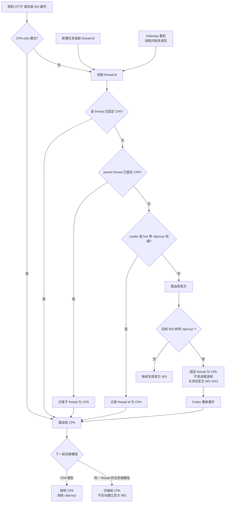
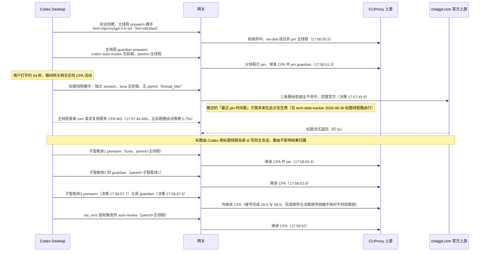
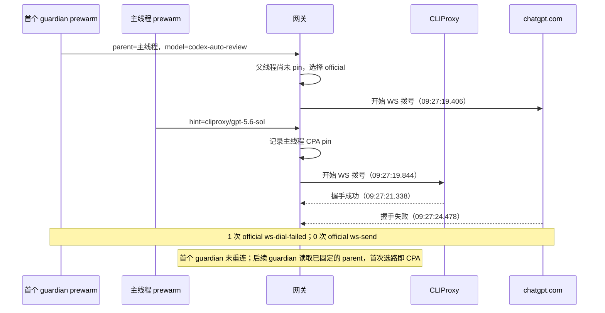

# Split 模式 Responses WebSocket 路由切换重连

> **状态**：已于 2026-08-30 完成自动化与真机验收并归档。
>
> **当前语义（2026-08-31）**：`websocket` 配置字段和
> `models --sync --websocket` 已删除。split 与 CPA-only 的 CPA Responses WebSocket
> 都一律桥接 CLIProxy，由上游按请求决定是否接受或回退 HTTP/SSE。
> 已固定 CPA 的同一 thread 及其子 thread 保持 CPA；当前 Codex Desktop 将
> `thread_title` 生成为无父标识的独立根线程，因此按现有路由规则走官方，且已作为
> 可接受边界记录到技术债。
> 首个 guardian prewarm 若早于父线程首次 CPA pin 到达，当前实现可能先选到官方；
> 2026-08-31 真机日志已确认该并发窗口并记录为待修复技术债。
> 下文中关于显式 `--websocket` 开关的方案、里程碑和日志是决策收敛前的
> 历史记录，不是当前操作指南。当前使用方式以 README 及本计划末尾的
> 2026-08-30 至 2026-08-31 决策记录为准。

## 目标

在非 CPA-only 的 split 模式下，官方模型继续连接官方上游，CPA 模型统一
桥接到 CLIProxy，由 CPA 按请求决定 WebSocket 或 HTTP/SSE 回退。
同一 `thread-id` 首次出现 `cliproxy/` 后固定走 CPA；该 thread 后续的无前缀帧、
HTTP/SSE 回退和 WS 重连都不得切回官方，子智能体按父 thread 单向继承 CPA。
无父标识且未固定的独立 thread（包括当前版本的 `thread_title`）继续按官方路由，
不因时间相邻或共享 `session-id` 被 CPA thread 污染。官方预热连接首次收到
`cliproxy/*` 帧时，仍以 `1012` 关闭旧连接并重连 CPA。网关不再提供 WebSocket
配置开关；上游拒绝握手时，仍由现有 426 语义让 Codex 降级 HTTP/SSE。

## 范围

- 包含：
  - 删除 `websocket` 配置字段与 `models --sync --websocket`，让 CPA Responses
    WebSocket 始终进入上游握手判断。
  - 同步 CLI 参数校验、状态、健康检查、TypeScript 类型、JSON Schema 和 README，
    不再暴露已删除的 WebSocket 开关。
  - 调整 `responsesWebSocketTarget()`：按 `x-codex-routing-hint` 选择 official/CLIProxy，
    CPA 路由不做模型前缀门控，并保留现有认证替换与握手头过滤。
  - 以 `thread-id` 保存进程内 CPA 粘性；显式 `cliproxy/` 是根线程的写入信号，子智能体
    通过 `x-codex-parent-thread-id` 单向继承父线程路由并记录自己的 `thread-id`。后续无前缀
    模型沿用 CPA；不得使用会被主线程与 subagent 共享的 `session-id` 做路由粘性。
  - 复用 `checkFrameRouting()` 与现有 `1012` 关闭流程：路由不一致的帧不得发送到旧上游，
    同时关闭上下游，由下一次握手重新执行目标选择和认证。
  - 已固定 CPA 的连接收到无前缀帧时继续转发 CPA；当前版本独立的 `thread_title`
    根线程无父标识，按未固定 thread 路由官方，不影响主线程及子智能体的 CPA 粘性。
  - 增加 official 预热 → CPA 粘性重连、标题路由、认证隔离、模型前缀剥离、426 回退、
    CLI 配置语义及可观测性的自动化测试和真机验收。
- 不包含：
  - 在同一条下游 WebSocket 内透明替换上游连接、上游连接池、按帧多路复用或响应合流。
  - 在网关内保存完整请求/响应历史，或自行把 `previous_response_id` 转换成完整上下文。
  - CLIProxyAPI 内部账号、渠道或凭据轮换；这些连接生命周期仍由 CLIProxyAPI 负责。
  - `/v1/live`、`/v1/realtime`、WebRTC sideband 等 Realtime 专用链路。
  - 在网关内替 CLIProxy 预判模型是否支持 WebSocket；该决定由 CPA 按请求处理。

## 背景

- 相关文档：
  - `docs/exec-plans/completed/responses-websocket-forwarding.md`
  - `docs/exec-plans/completed/cpa-only-websocket-forwarding.md`
  - `docs/histories/2026-08/20260820-1205-websocket-frame-routing.md`
  - `docs/histories/2026-08/20260827-1558-ws-model-gate.md`
  - `docs/exec-plans/tech-debt-tracker.md` 中的 Responses over WebSocket 路由项
  - [OpenAI Responses WebSocket 重连与恢复](https://developers.openai.com/api/docs/guides/websocket-mode#reconnect-and-recover)
- 相关代码路径：
  - `src/gateway.ts`：`responsesWebSocketTarget()`、`bridgeUpstreamWebSocket()`、
    `startGateway()` 与健康检查。
  - `src/realtime.ts`：`RealtimeSocketData`、`checkFrameRouting()`、
    `realtimeWebSocketHandler.message()`。
  - `src/cli.ts`：`applyRoutingMode()`、已删除参数的拒绝校验、`status` 输出。
  - `src/types.ts`、`schemas/gateway-config.schema.json`、`README.md`：配置契约与说明。
  - `test/gateway.test.ts`、`test/realtime.test.ts`、`test/app-server.test.ts`、
    `test/model-catalog-dynamic.test.ts`：路由、桥接、CLI 与模式切换测试。
- 已知约束：
  - Codex 会用 prewarm 握手提前建立连接，并跨 turn 复用同一条连接；握手 hint 可能属于
    预热模型，而真实文本帧可能已切换到另一条路由。
  - 真实日志中标题生成固定使用无前缀 Luna，`request_kind=turn`、`thread_source=system`；
    三个样本均晚于首个 turn 约 1.5–5 秒，且与首个 turn 使用相同 `thread-id`。
  - 同一 `session-id` 会包含主线程与 subagent 的多个 `thread-id`；路由必须按 thread 隔离。
  - official 与 CLIProxy 的上游 URL、认证域和凭据不同；路由变化后不得在旧连接上替换
    `Authorization`，也不得把任一侧凭据发送给另一侧。
  - 当前代码已经能检测帧路由不一致，并以 `1012` 关闭下游、关闭旧上游；
    split 与 CPA-only 的 CPA WebSocket 均无需开关。
  - `previous_response_id` 可能依赖原上游或原连接状态。官方文档说明：连接关闭后连接级
    缓存消失；无法继续时必须省略该 ID 并发送完整上下文。当前网关没有执行完整重放所需
    的历史状态。
  - 当前配置只有固定的 official 与 CLIProxy 两个上游；判断 `routeKind` 是否变化已经足够，
    不为未来的多上游场景提前新增 route-key 抽象。

## 路由流程图

- 同一 `thread-id` 的下一轮请求会保留 CPA 粘性；选择无前缀模型也不会切回官方。
- 子智能体建立独立 WS；`x-codex-parent-thread-id` 已固定 CPA 时，子 thread 单向继承 CPA。
- 同一 `session-id` 下无父子关系的新 `thread-id` 独立判断，可继续使用官方路由。
- 真正从 CPA 回到官方需要新建 thread；Gateway 重启虽会清空粘性，但不作为切换方式。

### 真机会话时序（2026-08-30 实测）

网关 17:47:46 重启（进程内粘性集合为空）后，新建 CPA 会话并触发两个子智能体与
auto review。日志：`cliproxy-v1-responses-ws-01a05219-*.log`（主线程树）与
`cliproxy-v1-responses-ws-01a0521a-7fe9-*.log`（标题线程）。

- pin 的写入时机是**会话创建时的 prewarm**，不是首条消息；标题在首条消息后才触发，
  因此「最近一次 pin」与标题请求的间隔是打字时长（本次 54s），10 秒级窗口不可行。
- 标题路由决策比主线程首帧早 0.75 秒；标题上游拨号随后才完成。决策时刻主 turn 尚未
  过网关，可用信号只有最近 pin 本身。
- 标题线程是独立根会话，与主线程在路由层零耦合：不共享连接与 pin 状态、不写
  `cpaThreads`，本次主线程树 7 次拨号全部 CPA、标题 1 次官方，全程零
  `ws-route-mismatch`、零 `ws-dial-failed`，主线程全程复用同一条 CPA WS。
- 版本差异注意：本计划「已知约束」中旧样本的标题与首个 turn 同 `thread-id`
  （`thread_source=system`）；当前 Desktop 0.151.0-alpha.7.2 已改为独立线程
  （`thread_source=thread_title`、`request_kind=prewarm`），标题路由随之独立于
  主线程，上方时序图以此为准。

## 风险

- 风险：Codex 收到 `1012` 后不重发当前帧，或新的 prewarm 握手仍携带旧 hint，造成请求
  丢失或重连循环。
- 缓解方式：把真机双向切换作为实现前置门；必须确认一次路由变化至多触发一次重连，
  且当前请求最终只执行一次。若不成立，停止放开 split CPA WebSocket，继续使用 426
  HTTP/SSE 回退，并单独评估一次性 session 路由提示；本计划不自动扩展成连接池。
- 风险：新上游无法识别旧路由生成的 `previous_response_id`，导致
  `previous_response_not_found`、tool call 断链或上下文丢失。
- 缓解方式：真机覆盖含连续对话和 tool call 的切换；验收必须看到客户端完整重放或可用的
  continuation 恢复。不能恢复时保持该功能默认关闭，并不得宣称跨路由连续性可用。
- 风险：CPA API Key、ChatGPT OAuth、`chatgpt-account-id` 或其他 API Key 泄漏到错误上游。
- 缓解方式：对两个方向分别断言实际握手头；CPA 路由必须剥 OAuth、账号 ID、`x-api-key`
  和 `x-goog-api-key` 后注入 CPA Key，官方路由不得出现 CPA Key。
- 风险：CPA 对非 WebSocket 原生模型的按请求回退可能在增量轮次触发 426。
- 缓解方式：保留 CPA 的请求级回退语义，将已知的 `upstream_http_replay_required` 风险
  记录到技术债，并通过真机连续对话验证是否需要客户端完整重放。
- 风险：配置语义变化导致原有 CPA-only 或默认 split 行为回归。
- 缓解方式：2026-08-30 起 `websocket` 开关已整体移除（见决策记录），CPA WebSocket
  一律桥接、由上游按请求判断；配置矩阵收敛为 CPA-only 与 split 两种模式。

## 里程碑

1. **真机前置验证与方案门控**
   - 在无网关侧 WebSocket 开关的 split 模式下，分别新建 official thread 与
     CPA thread。
   - 记录握手 hint、帧内模型、`ws-route-mismatch`、关闭码、下一次 `ws-dial` 目标和最终
     transport，确认 official thread 始终官方，CPA thread 首次识别前缀后始终 CPA。
   - 确认已固定 CPA 的 thread 及其子智能体继续走 CPA；无父标识、未固定的独立 thread
     （包括当前版本的 `thread_title`）继续走官方，互不污染。
   - 用连续对话及一次 tool call 验证 `previous_response_id` 在新路由不可用时是否会完整重放。
   - 若出现丢帧、重复执行或重连循环，停止后续放行，保留现有 HTTP/SSE 行为并更新本计划。
2. **收敛配置与 CLI 语义**
   - 删除 `models --sync --websocket` 与 `websocket` 配置字段，并显式拒绝旧参数。
   - `models --sync --cpa-only` 切换 CPA-only，无 flag 的 `models --sync` 切回
     split；模式实际变化时自动重启网关。
   - 更新健康检查、`status`、类型、Schema、帮助文本和 README，不再输出或记录
     已删除的 WebSocket 开关。
3. **放开 split CPA WebSocket 目标选择**
   - official 路由继续无条件允许 WebSocket；CPA 路由一律进入 CLIProxy 握手。
   - split 与 CPA-only 均将 CPA 请求桥接到 CLIProxy；不在网关层按模型 ID 做额外门控。
     无 hint 时保持现有安全回退，不猜测 CPA 路由。
   - 保留上游 URL 构造、前缀剥离、CPA 认证替换和握手头过滤，不新增路由层抽象。
4. **固化重连和安全边界测试**
   - 目标选择单测：split/CPA-only、两种路由、任意 CPA 模型、无 hint、
     旧 WebSocket 参数拒绝。
   - 帧测试：同路由正常转发；跨路由帧不触达旧上游，关闭下游 `1012` 并关闭旧上游；
     CPA 帧只剥一次 `cliproxy/` 前缀。
   - 桥接测试（official 预热 → CPA）：官方连接收到 `cliproxy/*` 后先固定 thread，再验证
     旧连接 1012 关闭、下一次无前缀握手仍拨到 CLIProxy、CPA Key 生效且 OAuth 不出站。
   - 标题测试：CPA 连接收到无前缀 Luna 帧时原样发送 CPA，不关闭上下游；另一个未固定的
     thread 使用同一 Luna 时仍建立官方 WS并保留 OAuth，避免跨 thread 串线。
   - CLI/配置测试：参数矩阵、Schema 描述、健康检查、`status` 和模式重置。
5. **交付与收尾**
   - 运行定向测试、类型检查和完整 `bun run check`。
   - 真机重复里程碑 1，确认无重连循环、无重复执行、无凭据串线，且 426 回退仍可用。
   - 更新 README、对应历史记录及 `tech-debt-tracker.md`；完成后将本计划移到
     `docs/exec-plans/completed/`。

## 验证方式

- 命令：
  - `bun test test/gateway.test.ts test/realtime.test.ts test/app-server.test.ts test/model-catalog-dynamic.test.ts`
  - `bun run typecheck`
  - `bun run check`
  - 后台测试单次最长运行 60 秒；超时应终止并定位，不得无限等待。
- 手工检查：
  - split：运行 `models --sync --restart-codex`，交替选择官方模型与 CPA
    模型完成多轮对话，确认两条 WebSocket 路由无需开关。
  - CPA-only：运行 `models --sync --cpa-only --restart-codex`，确认模型目录与请求
    都使用 CPA 原始模型 ID。模式切换会自动重启网关；`--restart-codex`
    只用于让 Codex app-server 重读目录。
  - 标题路由：CPA thread 首次 turn 后等待自动标题生成；当前版本应看到独立
    `thread_title` 根线程走官方，同时主线程和带 parent 的子智能体仍走 CPA，且无
    `ws-route-mismatch`。
  - 隔离检查：同一 session 下另建 official thread，确认无前缀模型仍走官方且不带 CPA Key。
  - CPA 回退：选择非 WebSocket 原生的 CPA 模型，确认由 CPA 按请求回退 HTTP/SSE；若
    增量轮返回 426，记录 `upstream_http_replay_required` 并保留默认关闭回滚路径。
  - 连续性：跨路由执行一次含 tool call 的多轮请求，确认没有
    `previous_response_not_found`、缺失 function call 或重复工具执行。
  - 回滚：`websocket` 开关已于 2026-08-30 移除；若 CPA WebSocket 行为异常，回滚手段是
    恢复网关侧门控代码，或在上游侧处理。
- 观测检查：
  - 路由变化时先出现 `ws-route-mismatch`，旧连接关闭后出现指向另一上游的 `ws-dial`；
    一次切换不得持续循环。
  - official → CPA 时，错误路由帧不出现在官方上游；新 CPA 帧中的模型已去掉
    `cliproxy/` 前缀。
  - CPA 握手日志中 OAuth、账号 ID 与其他 API Key 已遮蔽或不存在；官方握手不得包含
    CPA Key。
  - `status` 与 `/healthz` 显示实际路由模式，不再包含 WebSocket 配置状态。

## 验收标准

- split 与 CPA-only 下，CPA 和官方路由都能建立各自的 Responses
  WebSocket；CPA 的具体上游传输由 CLIProxy 按请求决定。
- official 预热连接收到 `cliproxy/*` 时，错误帧不会到达官方；thread 固定 CPA 后其
  无前缀帧仍走 CPA，不产生反向建连。
- 当前版本无父标识的独立 `thread_title` 根线程按未固定 thread 走官方，不改变 CPA
  主线程及其子智能体的连接与 pin 状态。
- 同一 session 中无父子关系且未固定的其他 thread 仍可使用官方路由，凭据不串线。
- 跨路由 continuation 能使用有效 ID 恢复，或在 ID 无效时完整重放；连续对话和 tool call
  不断链。
- 任一方向都不存在 OAuth、账号 ID、CPA Key 或其他 API Key 串线。
- CPA 按请求回退或上游拨号失败时，仍可靠返回 426 并降级 HTTP/SSE。
- 配置、Schema、CLI 帮助、README、状态输出和测试保持一致，`bun run check` 通过。

## 进度记录

- [x] 确认当前握手路由、逐帧校验、`1012` 关闭流程和 split CPA WebSocket 双层开关。
- [x] 收敛首选方案：复用现有“关闭整条桥接并由客户端重连”，不实现透明热换上游。
- [x] 完成配置与 CLI 语义调整。
- [x] 完成 split CPA WebSocket 目标选择调整。
- [x] 完成自动化测试和文档同步。
- [x] 日志复盘确认 official → CPA 方向端到端成立（见下方 2026-08-28 日志复盘）。
- [x] 实现 thread 级 CPA 粘性并覆盖 HTTP、WS 握手、官方 mismatch 固定、旧版本同
  thread 的无前缀 Luna 帧、父子 thread 单向继承和同 session 无关 thread 隔离测试。
- [x] 核实当前 Codex 版本的首帧顺序与标题元数据：`thread_title` 是独立 session 的
  无父根线程，路由决策早于主 turn 首帧 0.75 秒，按现有信号只能安全回落官方。
- [x] 部署后真机确认主线程、两个子智能体及 guardian 均保持 CPA；独立标题线程走官方，
  全程零 `ws-route-mismatch`、零 `ws-dial-failed`。同 session 无父子 thread 隔离由
  自动化测试覆盖；当前客户端标题使用独立 session，不再伪造不存在的同 session 样本。
- [x] 排查 2026-08-28 14:53:15 疑似丢帧：结案为无丢帧。此前“17 分钟无重试”的判断
  只检查了 WS 日志、遗漏了 HTTP 回退文件（见下方 2026-08-30 复盘）。
- [x] 完成真机验收、历史记录、债务更新和计划归档。

> 2026-08-28：实现与自动化验证已完成；真机前置验证与真机双向切换验收当时未执行，
> 因而继续保持 active；最终结论见下方 2026-08-30 最终验收。
>
> 2026-08-28（日志复盘，`~/.codex-cliproxy-gateway/logs/`）：official → CPA 方向已
> 实证：18:41:58 官方连接收到带前缀模型的帧触发 `ws-route-mismatch`，该帧未进入
> 旧上游；下游以 1012、旧上游关闭后约 1.8 秒重连并拨到 cliproxy；重发请求为
> 全量重放（30 个 input 项、无顶层 `previous_response_id`），单次执行、单次重连、
> 无循环。认证隔离有日志佐证：官方拨号仅官方 OAuth 与 `chatgpt-account-id`，
> CPA 拨号仅 CPA key（无 OAuth/账号 ID/x-api-key）；CPA 帧模型前缀已剥离。
> 426 回退链路亦实证：18:43:13 官方握手连续失败 2 次后，客户端 18:43:20 起改走
> HTTPS 且全部 200。当时遗留的 thread 粘性与标题路由真机复核，已在下方最终验收结案；
> 14:53:15 已结案为无丢帧（见下）。
>
> 2026-08-30（14:53:15 丢帧排查，已结案）：无丢帧，WS 日志、HTTP 日志与 Codex
> rollout（`rollout-2026-08-28T12-07-56-01a0468d-*.jsonl`）三方互证。完整链路：
> 14:52:42–14:53:13 用户把会话模型切到 `cliproxy/z.ai/glm-5.3`
> （`thread_settings_applied`），14:53:13.279 `task_started`；14:53:15.153 该 turn 的
> WS 帧（含 input_image）落在被复用的官方连接上，网关记 `ws-route-mismatch`、该帧
> 未转发并以 1012 关闭下游与旧官方上游——无错误上游泄漏、无重复执行；0.34 秒后
> Codex 携带 CPA hint 发起 GET 握手探测，收到 426 `websocket-not-supported`，原因是
> 当时运行中的网关仍为 `websocket: false`（`websocket: true` 的配置 15:00 才写入，
> state.json mtime 佐证），属默认关闭的预期降级；随后整个 turn 经 HTTP/SSE 完成：
> 14:53:32–14:56:48 共 13 次 `POST /v1/responses` 全部 200（同 session-id，含
> 14:56:13 一轮 codex-auto-review），rollout 于 14:53:29 出现 `item_completed`，会话
> 持续到 20:04 以 `task_complete` 正常结束，无 error/retry/abort 事件。与 18:41:58
> 走 WS 重握手的差异仅是当时的开关状态：flag off → 426 降级 SSE；flag on → CPA WS
> 重握手。两条恢复路径均获真机实证，Codex 对 1012 的恢复行为符合实现门槛。
> 另：15:10–15:13 官方拨号失败 ×2 与一例 CPA HTTP 502（free/glm-5.3-flash）为瞬时
> 网络抖动，15:13:36 恢复，与路由逻辑无关。
>
> 2026-08-30（最终验收）：当前 Desktop 的 `thread_title` 已变为独立根线程，因无
> 前缀、无自身 pin、无 parent，按安全默认走官方；该行为已接受并记录为技术债，不阻塞
> 交付。主线程树真机 7 次拨号全部 CPA，标题 1 次官方，零 route mismatch/dial failure；
> 子智能体独立 WS 的父 thread 继承成立。2026-08-28 的跨路由样本确认错误帧未出站、
> 1012 后完整重放 30 个 input 项（包含既有工具调用上下文）、无顶层
> `previous_response_id`、无重复执行或重连循环。完整 `bun run check` 通过 94 个测试，
> 计划归档。

### 2026-08-31 guardian prewarm 竞态复盘

真机会话在创建阶段并发发起主线程与首个 guardian prewarm。日志事件按拨号结束时间
落盘；结合 `durationMs` 回推，guardian 在主线程写入 CPA pin 前约 438ms 完成路由
决策并开始拨官方。guardian 虽携带 `x-codex-parent-thread-id`，但当时父线程尚未固定，
无前缀 `codex-auto-review` 因而按默认规则选择官方；父线程随后完成 pin，不会重算已在途
的 guardian 拨号目标。

- 这不是 `ws-route-mismatch` 拉回：官方握手未成功，没有进入逐帧检查；且无前缀
  `codex-auto-review` 本身也不会被显式 `cliproxy/*` mismatch 规则识别。
- 首个 guardian 的保留日志只有一次 official `ws-dial-failed`，没有
  `ws-upstream-open` 或 `ws-send`，因此该 WS 未向官方发送推理帧；当前保留范围内没有
  同 thread 的 HTTP/SSE 记录，不能据此断言客户端是否另行重试。
- 后续 12 个 guardian thread 的 19 条 `codex-auto-review` `response.create` 全部走 CPA；
  同会话的 12 个工作子智能体也全部走 CPA。它们不是首个 guardian 被拉回，而是在创建时
  直接继承了已固定的父 thread。
- 独立 `thread_title` 是无 parent 的 Luna 根线程，走官方属于既定边界，不归入 guardian
  竞态逃逸。主线程后续一次 CPA WS 拨号失败后，HTTP/SSE 回退仍携带 CPA 路由信号并由
  CPA 返回 `x-cpa-trace-id`，因此 fallback 未切回网关官方路由。

## 决策记录

- 2026-08-28：路由变化定义为 actual upstream/auth 域发生变化；同一 official 路由内或同一
  CLIProxy 路由内仅模型变化时继续复用连接。
- 2026-08-28：选择关闭下游 `1012` 与旧上游、由 Codex 新握手重建整条桥接；不在同一
  下游连接内替换 `upstream`，避免引入队列切换、事件重绑和跨上游状态迁移。
- 2026-08-28：复用现有 `websocket` 字段并保持默认 `false`；显式开关同时适用于 split 与
  CPA-only，official WebSocket 始终不受该字段控制。
- 2026-08-28：移除网关侧 CPA 模型前缀门控，所有 CPA 模型在显式开启后均桥接到
  CLIProxy，由 CPA 按请求自行选择 WebSocket 或 HTTP/SSE。
- 2026-08-28：把 Codex 对 `1012` 的真实重试和完整重放行为设为实现门槛；未验证前不把
  split CPA WebSocket 视为可交付能力，也不为绕过该门槛自动扩展成多路复用方案。
- 2026-08-30：首次明确的 `cliproxy/` 信号按 `thread-id` 固定 CPA；同一 thread 后续
  无前缀帧沿用 CPA。当前版本的 `thread_title` 是无父标识的独立根线程，按未固定 thread
  走官方；不把时间邻近或 `session-id` 当作继承信号，避免跨 thread 误路由。
- 2026-08-30：子智能体使用独立 WebSocket 和 `thread-id`；通过
  `x-codex-parent-thread-id` 单向继承已固定 CPA 的父线程，并把子 `thread-id` 加入同一
  进程内集合。子线程选择 CPA 不反向改变父线程路由。
- 2026-08-30：移除 `websocket` 配置字段与 `models --sync --websocket` 参数。网关侧不再
  保留 CPA WebSocket 开关：CPA 路由的 WS 升级一律桥接 CLIProxy，上游不支持时由拨号
  失败路径回 426 降级 HTTP/SSE（「由上游判断返回」）。原「未传参数回写 false」的回滚
  路径随之失效，回滚 = 恢复网关侧门控代码。同日起 `cpaOnly` 与日志开关由新的
  `config` 命令管理，`models --sync` 不再修改任何路由模式字段，所有配置变更写入
  `logs/cliproxy-config-*.log` 审计。
- 2026-08-30（评审修正）：`cpaOnly` 切换回归 `models --sync --cpa-only`（布尔开关，
  无 flag 即 split；与 `--restart-codex` 一步到位），`config` 命令仅保留设置打印与
  `--log on|off`。同轮评审修复：TOML literal string（单引号）纳入非受管守卫、值不可
  解析时显式报错；命令级参数白名单；重启失败的 pendingRestart 标记与重试；preflight
  写盘审计与审计 URL query 脱敏。
- 2026-08-31：确认父线程首次 CPA pin 与 guardian prewarm 存在并发窗口；带 parent 的
  guardian 只在目标选择时读取父 pin，已在途拨号不会因稍后 pin 重判。本次错误官方握手
  失败且没有通过该 WS 发送推理帧，但若握手成功，无前缀 `codex-auto-review` 不会触发现有
  显式前缀 mismatch 防护，因此作为路由安全技术债继续跟踪，不把独立 `thread_title`
  混入该问题。
